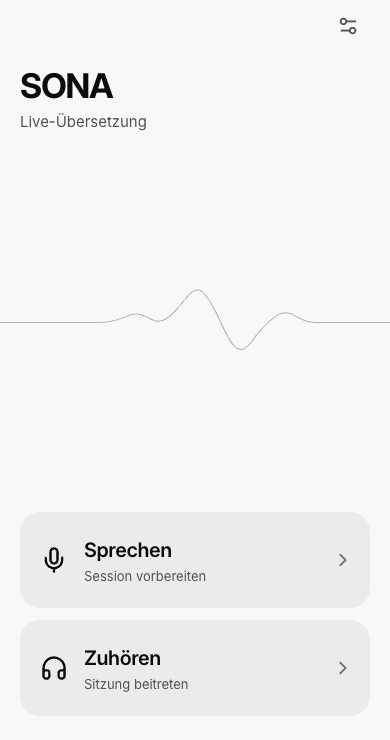
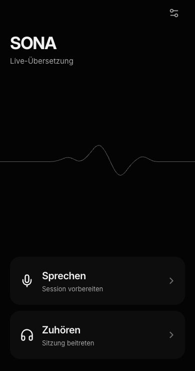
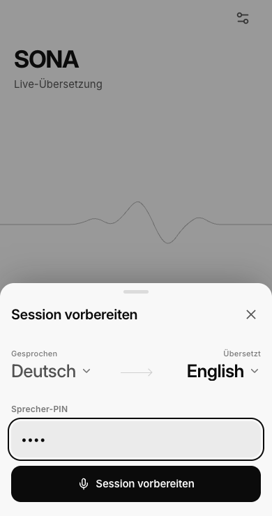
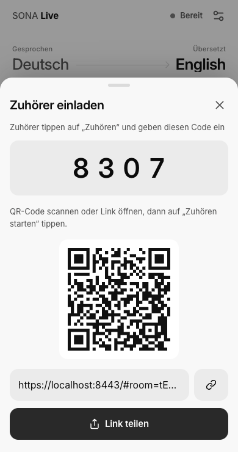
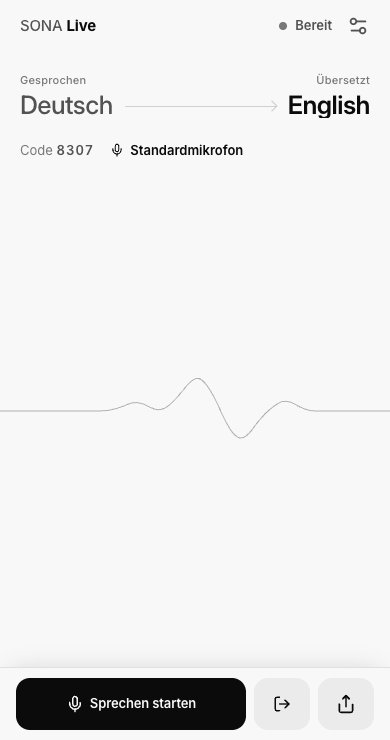
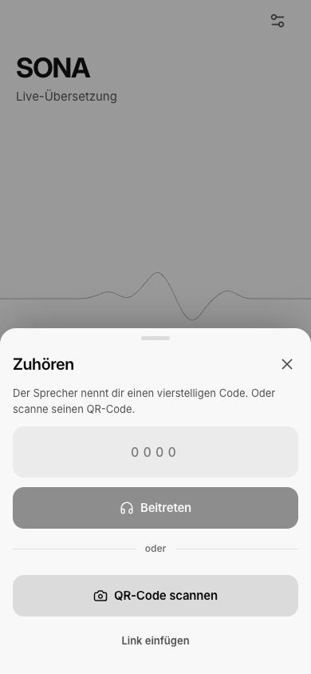
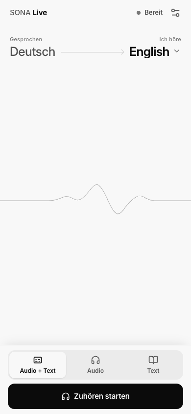
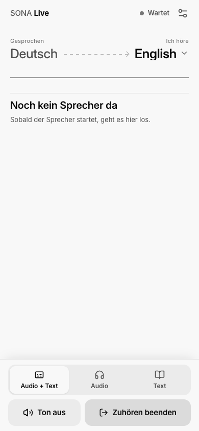

# SONA Live

One speaker, many listeners: live translated audio and text in the browser. React/Vite frontend, FastAPI backend and HAProxy for HTTPS, all in one Compose stack. Speaker access by PIN, no user accounts, no database, no recording.

## Home screen

Choose **Sprechen** to prepare a speaker session or **Zuhören** to join one. The settings button in the top right changes the interface language and appearance.

| Light | Dark |
| --- | --- |
| <a href="docs/images/home-light.png"></a> | <a href="docs/images/home-dark.png"></a> |

## Setup

```sh
git clone git@github.com:skiweg1985/realtime-translator.git
cd realtime-translator
cp .env.example .env               # enter TRANSLATE_KEY, see below
./setup-certs.sh YOUR_LAN_IP YOUR_MAC_HOSTNAME.local
docker compose up -d --build
```

Then open `https://YOUR_LAN_IP:8443` on any device in the same network.

## Configuration

Everything lives in `.env`. **Only `TRANSLATE_KEY` has to be filled in**, the rest has working defaults.

| Variable | Required | Default | Meaning |
| --- | --- | --- | --- |
| `TRANSLATE_KEY` | **yes** | – | LiteLLM Virtual Key for the Translate route |
| `SPEAKER_PIN` | no | `0000` | Exactly four digits required to create a session; leading zeros are preserved |
| `TRANSLATE_URL` | no | `wss://litellm-test.simplicity.ag/v1/realtime/translations?model=azure-live-translate` | Upstream WebSocket |
| `TRANSLATE_TRANSCRIPTION_MODEL` | no | `gpt-realtime-whisper` | Original-language captions; `off` disables them |
| `TRANSLATE_NOISE_REDUCTION` | no | `near_field` | `near_field`, `far_field` or `off`; the speaker can override it per session in the app |
| `HTTPS_PORT` / `HTTP_PORT` | no | `8443` / `8080` | Host ports published by HAProxy |

The key must be scoped to exactly `models: [azure-live-translate]` and `allowed_routes: [/v1/realtime/translations]`; the gateway rejects broader keys on that route. It must also allow four parallel connections, as must `LITELLM_TRANSLATE_MAX_PARALLEL` on the gateway. Browsers never see the key. After replacing it: `docker compose up -d --force-recreate app`.

An omitted `SPEAKER_PIN` defaults to `0000`; an empty value or anything other than four ASCII digits prevents startup. The PIN is checked by the backend and is not included in shared links. Change it in `.env` and recreate the app container to apply it. Sessions and their speaker access disappear on restart. Inactive rooms older than two hours are removed when another session is created, so a prepared link is not a permanent reservation.

## Trust the certificate on iPhone

1. Open `http://YOUR_LAN_IP:8080/local-ca.cer` in Safari.
2. Install the profile in Settings → General → VPN & Device Management.
3. Enable full trust for **Translate Local Development CA** in Settings → General → About → Certificate Trust Settings.

On desktop, import `certs/ca.crt` instead. The server certificate is valid 90 days and covers the IP and hostname you passed to `setup-certs.sh`; rerun it after an IP change, then rebuild. Never distribute `certs/ca.key`.

## Use

The screenshots show the German interface. The code and localhost link are examples from a session that has been ended; use the code or link from your own session.

<!-- Screenshots: German UI, 390 x 740; home in both themes, guide in light. Refresh the affected images together when these flows change, and end the capture session afterward. -->

### Speaker

| 1. Prepare | 2. Invite listeners | 3. Start speaking |
| --- | --- | --- |
| <a href="docs/images/speaker-prepare.png"></a> | <a href="docs/images/speaker-share.png"></a> | <a href="docs/images/speaker-ready.png"></a> |
| Tap **Sprechen** on the home screen. Choose the languages, enter the speaker PIN, then tap **Session vorbereiten**. | Share the code, QR code or link. Listeners can join before you start speaking. | Close the share dialog, tap **Sprechen starten**, and allow microphone access. This starts the translation. |

The languages are fixed when the session is created. **Mikro aus** mutes the microphone; **Sprechen beenden** pauses the broadcast and **Weiter sprechen** resumes it. **Sitzung beenden** ends the session for everyone, including before the first broadcast (the exit icon beside the start button). Reloading in the same tab retains speaker access. If microphone access is denied, the session remains available for another attempt.

### Listener

| 1. Join | 2. Choose your language and mode | 3. Wait for the speaker |
| --- | --- | --- |
| <a href="docs/images/listener-join.png"></a> | <a href="docs/images/listener-ready.png"></a> | <a href="docs/images/listener-waiting.png"></a> |
| Tap **Zuhören** and enter the speaker's session code or scan the QR code. Opening the shared link also takes you to the session. The speaker PIN is not needed. | Tap **Ich höre** to choose a language. Select **Audio + Text**, **Audio** or **Text**, then **Zuhören starten** (or **Mitlesen starten** for text only). | **Wartet** means you are connected. Translation starts when the speaker begins; no need to join again. **Zuhören beenden** leaves the session. |

You can change the listening language or mode at any time. **Text** mode also offers text sizes and a focus view.

## How it works

Microphone → AudioWorklet (24 kHz mono PCM16) → app WebSocket → one upstream translation connection per requested target language. Listeners on the same language share a connection. The channel for the room's default language additionally requests `audio.input.transcription` and delivers the original-language captions, so it stays open for the whole speaking time.

Target languages: the 13 official ones for `gpt-realtime-translate` (en, de, fr, es, it, pt, ja, zh, ru, ko, hi, id, vi) plus nl, pl, uk and ar. The list lives in `backend/main.py` and `frontend/src/main.tsx`; a test fails when the two differ.

## Limits

One active speaker globally, up to 31 listeners, at most four target languages (one of them carries the captions), ten minutes per session. Rooms and text live in memory only and disappear when the container restarts. A link grants access to a room, so share it only with intended listeners. The shared speaker PIN protects session creation; it is separate from the public listener code. Listener access still needs no PIN. This stack belongs on a trusted local network, not on the open Internet. The upstream service incurs usage charges.

## Develop

```sh
cd frontend && npm install && npm run dev
```

`http://localhost:5173` proxies `/api` and the WebSocket to the running stack on 8443, so the full flow works without installing the certificate.

## Test

```sh
python3 -m pip install -r backend/requirements.txt pytest httpx
mkdir -p backend/static && PYTHONPATH=backend python3 -m pytest tests/ -q
```

`tests/live_acceptance.py` and `tests/live_multilingual.py` run against the real endpoint, incur usage and need the speaker slot free. Set `SPEAKER_PIN` in the test process environment to match the server (default `0000`). They want a PCM16 mono 24 kHz WAV, which macOS can produce with `say -v Anna -o clip.aiff -f text.txt` followed by `afconvert -f WAVE -d LEI16@24000 -c 1 clip.aiff clip.wav`.

## Operate

```sh
docker compose ps
docker compose logs --tail=30 app
docker compose up -d --force-recreate app   # apply .env changes
docker compose down
```

`GET /api/health` reports whether the key and captions are configured and which noise reduction is active. There is deliberately one Uvicorn worker: rooms and fan-out are in memory.
